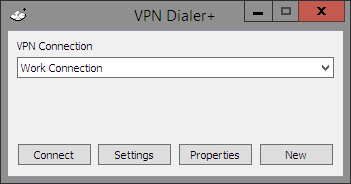
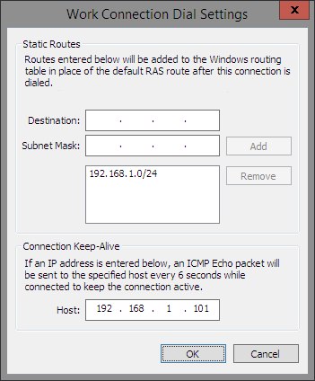

VPN Dialer+
===========

VPN Dialer+ is a lightweight utility that works with the Windows VPN Client to enable easy management of [split-tunnel](https://en.wikipedia.org/wiki/Split_tunneling) configurations.

Under most configurations, when you connect to a VPN, all traffic is sent over the VPN, whether it needs to be or not.

With split tunneling, you can connect to a VPN and route only traffic that is destined for specific IP addresses or ranges over the VPN, while using your local Internet connection directly for all other traffic.  This type of configuration has several benefits:

* You can connect to multiple VPNs at the same time and have traffic routed appropriately for each one.
* Your non-VPN traffic will move at the speed of your local Internet connection, not the speed of the VPN.
* Your non-VPN traffic is not subject to any filtering or snooping that might be in place on the VPN network.

App Features
------------

* Automatically monitor VPN connection status and apply routing updates when the VPN is connected/disconnected.
* Prevent idle disconnection by sending periodic ICMP packets to a target over the VPN.
* Compact program with low memory footprint so you can leave it running at all times.
* Minimizes to the System Tray to keep out of your way.

Requirements
------------

Windows Vista or later.  You must have admin permissions to modify the routing table.

Installation
------------

VPN Dialer+ is a portable .exe with zero external dependencies.  Configuration is stored in the AppData folder.

Binaries for x86 and x64 Windows are available on the [releases page](https://github.com/saucecontrol/VpnDialerPlus/releases).

Usage
-----

The main dialog is simple, with a dropdown list of VPN connections and four buttons

### New

Create a new VPN connection.  This button simply launches the Windows New VPN Connection dialog.

### Properties

Change VPN connection properties.  This button simply launches the Windows VPN Connection Properties dialog.

### Connect

Connect the selected VPN and add your custom routes.  If your connection does not have your authentication information saved, you will be prompted for credentials.

### Settings

Launches the VPN Dialer+ Settings dialog for the selected connection.

### Static Routes

Add IP address and subnet mask information for any custom routes you would like for this connection.  Your routes will replace the default route from the connection.

The routes you configure may have a subnet mask of any length.  A subnet mask of 0.0.0.0 will route all traffic through the VPN.  A subnet mask of 255.255.255.255 will route traffic to only a single IP address through the VPN.  You may enter multiple routes to networks and/or hosts.

### Connection Keep-Alive

If the VPN to which you are connecting has an idle timeout configured, you may be able to prevent being detected as idle by sending an ICMP echo packet over the connection periodically.

Enter an IP address of a server or other host that is likely to be always on, and VPN Dialer+ will ping it every 6 seconds to keep your connection active.
